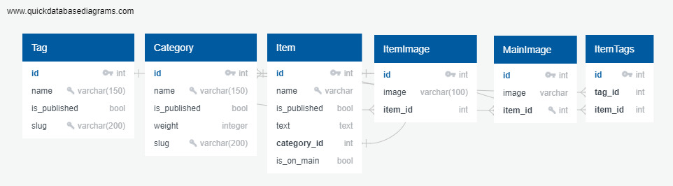

# Для успешного запуска проекта:

## Создание и включение venv:
```sh
python -m venv venv
source venv/bin/activate
```

## Установка зависимостей для запуска в продакшене:
```sh
pip install -r requirements/prod.txt
```


## Установка зависимостей для разработки:
```sh
pip install -r requirements/dev.txt
```

## Установка зависимостей для запуска тестов:
```sh
pip install -r requirements/test.txt
```


## Файл .env
#### Переименуйте файл "test.env" по пути lyceum/lyceum в ".env" и впишите в переменню "SECRET_KEY" свой ключ

## python manage.py thumbnail clear
#### Команда нужно чтобы корректно отобразились все картинки, ниже указан порядок ввода

## Включение сервера:
```sh
cd lyceum
python manage.py thumbnail clear
python manage.py runserver
```


# О сайте:

## Структура базы данных


## Мультиязычность
#### Сайт умеет в русский и английский языки
#### Для создания перевода воспользуйтесь

```sh
django-admin compilemessages
```

## Фикстурчики
#### Лежат в lyceum/fixtures/, стараюсь держать актуальными


З.Ы. 000 дробь это очень-очень локальный мем, поэтому название не случайно :D


